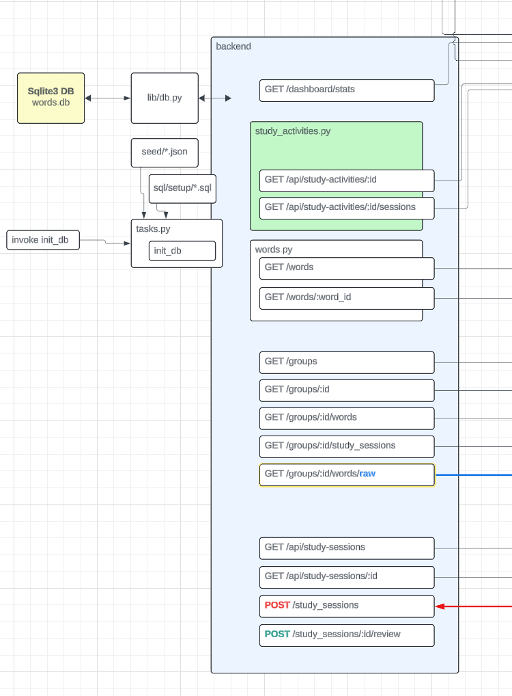

# Week 1 

1. GenAI Dev and Dev Tools
2. Working with [Backend for Lang Portal](https://docs.google.com/document/d/1KVDTDF4t8VtI69F5KMo67KoTBXgVhsd2O9hK-uPh2rA/preview?pli=1&tab=t.nzd37qs3zbdj)
3. Working with [Frontend for Lang Portal](https://docs.google.com/document/d/1KVDTDF4t8VtI69F5KMo67KoTBXgVhsd2O9hK-uPh2rA/preview?pli=1&tab=t.vxkrtpyo61l4)
4. Analyzing and Exploring Code when there is a lack of documentation
5. Generating test code to gain test coverage
6. Rapidly prototyping apps using GenAI
7. DevOps (LLMOps) with OPEA

## Backend Home Challenge

Level 1: Reimplement the missing API endpoints
Level 5: Rebuild the entire backend from scratch

## Backend Runthrough

- Look at Database Schema and note the relationships

### Backend Project Overview

1. **Technology Stack**
   - Flask web framework
   - SQLite database (words.db)
   - Flask-CORS for handling cross-origin requests
   - Pytest for testing

2. **Project Structure**
   - `app.py`: Main application file with CORS and route configurations
   - `routes/`: Contains API endpoints for:
     - Words management
     - Group management
     - Study sessions
     - Study activities
     - Dashboard
   - `lib/`: Library code
   - `sql/`: Database schema and migrations
   - `seed/`: Data seeding scripts
   - `migrate.py`: Database migration script
   - `tasks.py`: Task definitions

3. **Key Features**
   - Word management system
   - Group organization
   - Study session tracking
   - Study activity monitoring
   - Dashboard analytics

4. **Development Tools**
   - Migration system for database changes
   - Seeding capability for test data
   - Testing framework with pytest

5. **API Endpoints**
   - `/words`: Word management
   - `/groups`: Group management
   - `/study-sessions`: Study session tracking
   - `/study-activities`: Activity monitoring
   - `/dashboard`: Analytics and reporting

### Detailed Routes Analysis

1. **Words Routes** (`words.py`)
   - `GET /words`: List all words with pagination
   - `GET /word/<id>`: Get specific word details

2. **Groups Routes** (`groups.py`)
   - `GET /groups`: List all groups with pagination and sorting
   - `GET /groups/<id>`: Get specific group details
   - `GET /groups/<id>/words`: Get words in a specific group
   - `GET /groups/<id>/study-sessions`: Get study sessions for a group

3. **Study Sessions Routes** (`study_sessions.py`)
   - `GET /study-sessions`: List all study sessions with pagination
   - `GET /study-sessions/<id>`: Get specific session details
   - `POST /study-sessions`: Create new study session (TODO)
   - Special endpoint: `reset_study_sessions` for development

4. **Study Activities Routes** (`study_activities.py`)
   - `GET /study-activities`: List all available activities
   - `GET /study-activities/<id>`: Get specific activity details
   - `GET /study-activities/<id>/launch`: Get activity launch data with groups
   - `GET /study-activities/<id>/sessions`: Get sessions for an activity

5. **Dashboard Routes** (`dashboard.py`)
   - `GET /dashboard/recent-session`: Get most recent study session with:
     - Activity name
     - Correct/wrong answer counts
     - Creation timestamp
   - `GET /dashboard/study-stats`: Get study statistics

Key Features:
- Cross-Origin Resource Sharing (CORS) enabled for all routes
- Pagination support for list endpoints
- Error handling with appropriate HTTP status codes
- SQL queries for complex data relationships
- JSON responses with consistent formatting

6. **Platform Features**
   - Managing vocabulary words
   - Organizing words into groups
   - Tracking study sessions
   - Monitoring learning activities
   - Providing analytics through a dashboard

### Ryan's tips for Cursor: 
- used Project Rules for Flask (he asked Cursor Chat to add rules to follow for Flask) (.cursor/rules/rule.mdc)
- Cursor has Chat, Composer, and Bug Finder

**Note**: There's an inconsistency in the API routes:
- Some routes use `/api/` prefix (study-sessions, study-activities)
- Others use root path (words, groups, dashboard)
This might be something to standardize in future updates.
